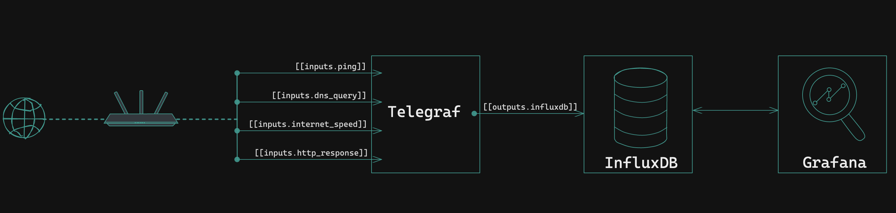

# ISP-Watchtower

- [ISP-Watchtower](#isp-watchtower)
  - [Overview](#overview)
    - [High level architecture](#high-level-architecture)
      - [Components](#components)
      - [Diagram](#diagram)
      - [Operation](#operation)
  - [Requirements](#requirements)
  - [Installation](#installation)

## Overview

This project sets up a simple and effective monitoring solution for your home network's Internet Service Provider (ISP) performance. It uses Telegraf, InfluxDB, Grafana ( TIG ) stack, running on docker to collect data using various telegraf plugins and display it in an easy-to-understand graphical interface.

### High level architecture

#### Components

- [InfluxDB](https://www.influxdata.com/products/influxdb-overview/)  is a high-performance time-series database used to store and analyze metrics and events data.
- [Telegraf](https://www.influxdata.com/time-series-platform/telegraf/) is an open-source agent that collects, processes, and sends metrics and data from various sources to different datastores like InfluxDB.
- [Grafana](https://grafana.com/) is an open-source visualization and analytics software used for monitoring and analyzing data from various sources.

#### Diagram



#### Operation

- Telegraf is installed on a server or a device in the network that has access to the internet, and it's configured to collect data about ping response times, internet speed, and DNS queries etc.
- Telegraf sends the collected data to InfluxDB, which is a time-series database that stores and organizes the data.
- Grafana is then used to visualize the data collected by Telegraf and stored in InfluxDB, providing real-time monitoring of ping response times, internet speed, and DNS queries.
- Dashboards can be created in Grafana to display the data in a graphical format, allowing for easy monitoring and analysis of the network's performance.

NOTE:
> The entire stack can be deployed on a single device/server in the network, or can be decoupled and installed on different systems, as long as the components (TIG) have network reachability to each other.
>
> The individual components can be installed as docker containers or natively as well.

## Requirements

- docker
- docker-compose
- internet connectivity
- git

## Installation

- Clone this repository using following command:

```shell
Using SSH
---------
git clone git@github.com:UchihaItachiSama/ISP-Watchtower.git
```

OR

```shell
Using HTTPS
-----------
git clone https://github.com/UchihaItachiSama/ISP-Watchtower.git
```
