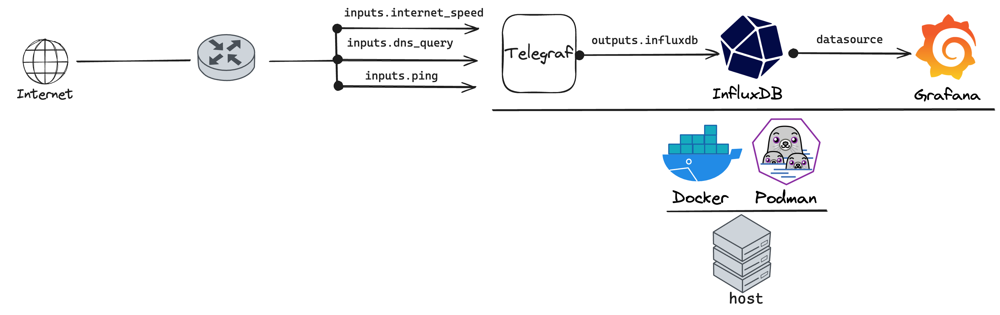
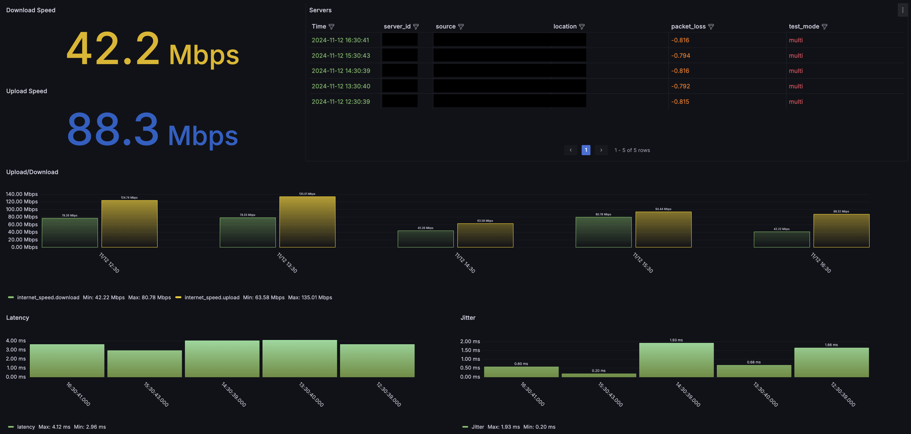
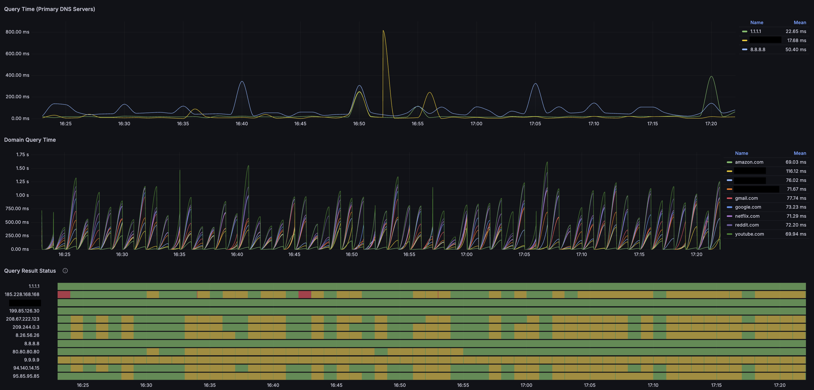

# ISP-Watchtower

- [ISP-Watchtower](#isp-watchtower)
  - [Overview](#overview)
    - [High level architecture](#high-level-architecture)
      - [Components](#components)
      - [Diagram](#diagram)
      - [Operation](#operation)
  - [Installation](#installation)
    - [Using Podman](#using-podman)
    - [Using docker](#using-docker)

## Overview

This project sets up a simple monitoring solution for home network's Internet Service Provider (ISP) performance. It uses Telegraf, InfluxDB, Grafana ( TIG ) stack, running in containers to collect data using various telegraf plugins and display it in an easy-to-understand graphical interface.

### High level architecture

#### Components

- [InfluxDB](https://www.influxdata.com/products/influxdb-overview/)  is a high-performance time-series database used to store and analyze metrics and events data.
- [Telegraf](https://www.influxdata.com/time-series-platform/telegraf/) is an open-source agent that collects, processes, and sends metrics and data from various sources to different datastores like InfluxDB.
- [Grafana](https://grafana.com/) is an open-source visualization and analytics software used for monitoring and analyzing data from various sources.

#### Diagram



#### Operation

- Telegraf based on the input plugins will collect data about ping response times, internet speed, and DNS queries etc.
- Telegraf then sends the collected data to InfluxDB, which is a time-series database that stores and organizes the data.
- Grafana is then used to visualize the data collected by Telegraf and stored in InfluxDB, providing real-time monitoring of ping response times, internet speed, and DNS queries.
- Dashboards can be created in Grafana to display the data in a graphical format, for example sample dashboard included in this repo.

|||
|-|-|
| |  |

NOTE:
> The entire stack can be deployed using docker or podman.
>
> The individual components can be installed as containers or natively as well.

## Installation

- Clone this repository using following command:

```shell
Using SSH
---------
git clone git@github.com:UchihaItachiSama/ISP-Watchtower.git

OR

Using HTTPS
-----------
git clone https://github.com/UchihaItachiSama/ISP-Watchtower.git
```

- Have the required packages installed for example if using docker based installation have docker, docker-compose installed, similarly for podman have required setup completed before proceeding.
- Following are the files in the repository
  - `ISP-Watchtower/monitoring/telegraf/telegraf.conf` contains the telegraf configuration for input and output plugins.
  - `ISP-Watchtower/monitoring/grafana/provisioning/datasources/` folder contains the InfluxDB datasource YAML file
  - `ISP-Watchtower/monitoring/grafana/provisioning/dashboards/` contains the dashboard YAML and JSON file
  - `ISP-Watchtower/monitoring/podman/` contains the Kubernetes YAML definition files for deploying the volumes & pods using podman

```shell
ISP-Watchtower/monitoring/
├── grafana
│   └── provisioning
│       ├── dashboards
│       │   ├── dashboard.yaml
│       │   └── isp-watchtower.json
│       └── datasources
│           └── datasources.yaml
├── podman
│   ├── grafana-pod.yaml
│   ├── influxdb-pod.yaml
│   ├── persistent-volumes.yaml
│   └── telegraf-pod.yaml
├── telegraf
│   └── telegraf.conf
└── tools
    └── manage-pods.sh
```

### Using Podman

- Refer to below section if deploying the TIG container stack using podman
- Move to the `monitoring` folder

```shell
cd ISP-Watchtower/monitoring/
```

- Create the volumes for Grafana and InfluxDB

```shell
podman kube play podman/persistent-volumes.yaml

--

podman volume ls

DRIVER      VOLUME NAME
local       grafana-data-pvc
local       influxdb-data-pvc
```

- Deploy the pods

```shell
podman kube play podman/influxdb-pod.yaml
podman kube play podman/telegraf-pod.yaml
podman kube play podman/grafana-pod.yaml
```

- Confirm the pods are up and running

```shell
podman pod ls

POD ID        NAME        STATUS      CREATED      INFRA ID      # OF CONTAINERS
97ed8c6fac51  telegraf    Running     6 hours ago  1bc9fe7c0c88  2
35dc24ddfd6b  grafana     Running     6 hours ago  56cd68dfa7df  2
4a5d27ddc17b  influxdb    Running     6 hours ago  0e7128f3fb93  2
```

- If using any firewall filtering on host, allow the connection for TCP port `3000`
- Connect to Grafana UI on `http://<host-ip>:3000/`
- Login using username / password set in `grafana-pod.yaml`, password can be changed to a stronger password.
- Confirm datasource `Home -> Connections -> Data sources -> influxdb` is visible and tested to be working
- Open the `Home -> Dashboards -> ISP Watchtower` dashboard

### Using docker

- Refer to below section if deploying the TIG container stack using podman
